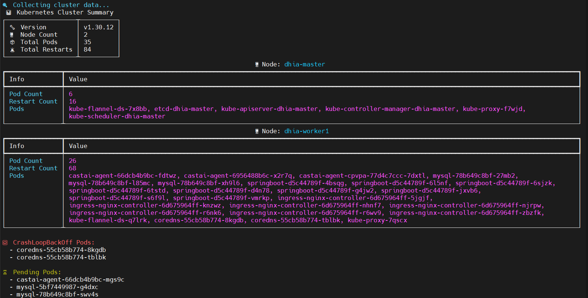

# 🤖 Kubernetes AI Advisor CLI

A powerful command-line tool that leverages **Google Gemini AI** to analyze your Kubernetes cluster and provide intelligent recommendations for optimization, monitoring, and security.

[](https://opensource.org/licenses/MIT)
[](https://www.python.org/downloads/)


## ✨ Features

- 📊 **Cluster Analysis**: Comprehensive health metrics and intelligent recommendations
- 📈 **Smart Monitoring**: AI-generated alerting rules for proactive management
- 🔄 **Auto-healing**: Automated recovery suggestions for common issues
- 💰 **Cost Optimization**: Resource utilization and cost-saving recommendations
- 🔐 **Security Audit**: Best practices and security hardening suggestions

## 🚀 Quick Start

1. **Clone the repository**
   ```bash
   git clone https://github.com/medDhiaAlaya/k8s_advisor.git
   cd k8s-ai-advisor
   ```

2. **Install dependencies**
   ```bash
   pip install -r requirements.txt
   ```

3. **Configure API Key**
   Create a `.env` file in the project root:
   ```bash
   GEMINI_API_KEY=your_gemini_api_key_here
   ```

4. **Run the advisor**
   ```bash
   python main.py
   ```

## 📋 Output Files

The tool generates the following output files:
- `recommendations.txt`: General cluster improvements
- `alerts.txt`: Monitoring and alerting rules
- `healing.txt`: Auto-healing suggestions
- `cost.txt`: Cost optimization recommendations
- `security.txt`: Security best practices

## 🏗️ Project Structure

```
k8s-ai-advisor/
├── main.py              # CLI entry point
├── k8s_collector.py     # Kubernetes metrics collection
├── gemini_client.py     # Gemini AI integration
├── utils.py            # Helper utilities
├── ai/
│   ├── analysis.py     # Cluster analysis
│   ├── monitoring.py   # Alerting suggestions
│   ├── autohealing.py  # Auto-healing logic
│   ├── cost.py        # Cost optimization
│   └── security.py    # Security analysis
├── requirements.txt    # Python dependencies
└── .env               # API configuration
```

## 🔧 Prerequisites

- Python 3.8 or higher
- Kubernetes cluster access
- Google Gemini API key
- `kubectl` configured with cluster access

## 🤝 Contributing

Contributions are welcome! Please feel free to submit a Pull Request. For major changes, please open an issue first to discuss what you would like to change.

1. Fork the repository
2. Create your feature branch (`git checkout -b feature/AmazingFeature`)
3. Commit your changes (`git commit -m 'Add some AmazingFeature'`)
4. Push to the branch (`git push origin feature/AmazingFeature`)
5. Open a Pull Request

## 📝 License

This project is licensed under the MIT License - see the [LICENSE](LICENSE) file for details.

## 👥 Authors

- **Mohamed Dhia Alaya - MDA** - *Initial work*

## 🙏 Acknowledgments

- Google Gemini AI for providing the AI capabilities
- Kubernetes community for the excellent documentation
- All contributors who have helped improve this project

## 📸 Screenshots

### Main Dashboard

<!-- *Comprehensive cluster overview with key metrics and health indicators* -->

### AI Recommendations

<!-- *Gemini AI-powered analysis and recommendations* -->

### Cost Alerts and auto-Healing Suggestions

<!-- *Resource utilization and cost-saving suggestions* -->

<!-- ### Security Analysis
 -->
<!-- *Security best practices and hardening recommendations* -->
